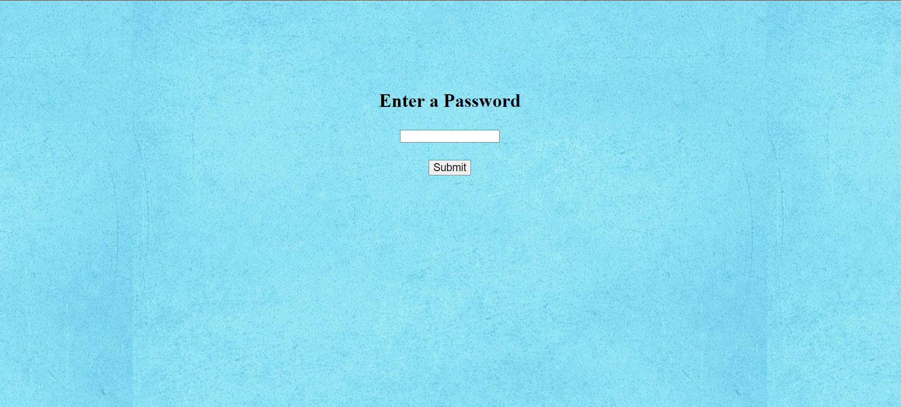
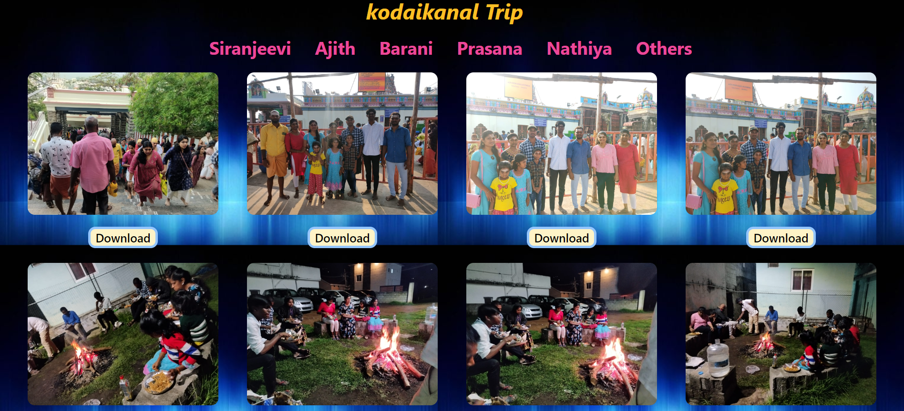

# Family Tour Trip Photo Website

This project is a personal website showcasing photos from my family tour trips. It's built using HTML, JavaScript, and Tailwind CSS.

## Features

- **Password Protection:** The website is password-protected to ensure privacy.
- **Photo Gallery:** Browse through a collection of photos from various family tour trips.
- **Responsive Design:** The website is designed to work well on different devices and screen sizes.

## How to Access the Website

To access the website, you'll need the password provided for entry. Once you have the password, follow these steps:

1. Clone the repository to your local machine.
2. Open the `index.html` file in your web browser.
3. Enter the password when prompted to access the website.

## Technologies Used

- HTML
- JavaScript
- Tailwind CSS

## Screenshots

## Link

This project Link https://kodaikanal.vercel.app

---

Replace `password.png` and `Opening.png`  with the actual paths or URLs of screenshots showcasing your website. You can also add more sections like "Installation Instructions" or "Usage" depending on what information you want to provide in your README.
